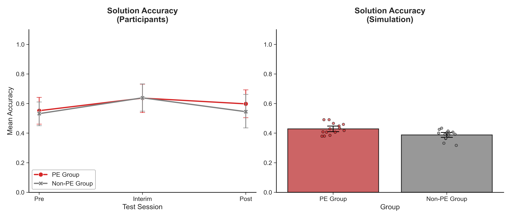
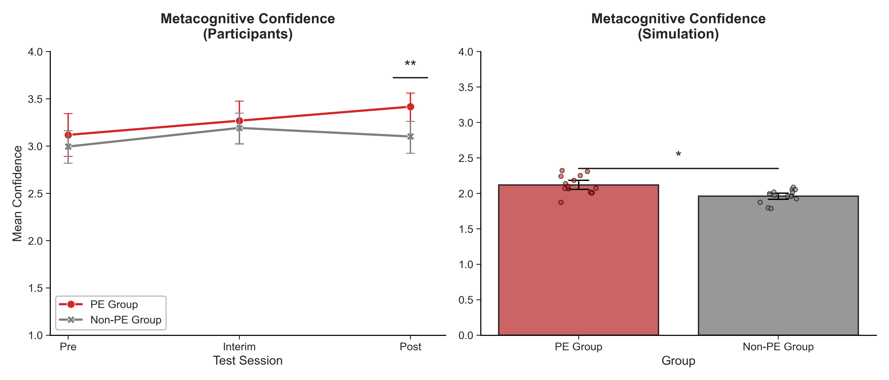
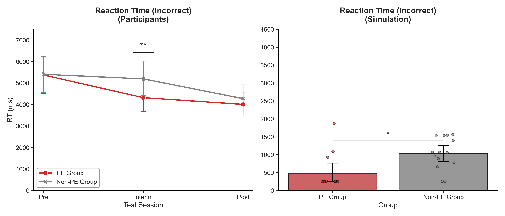
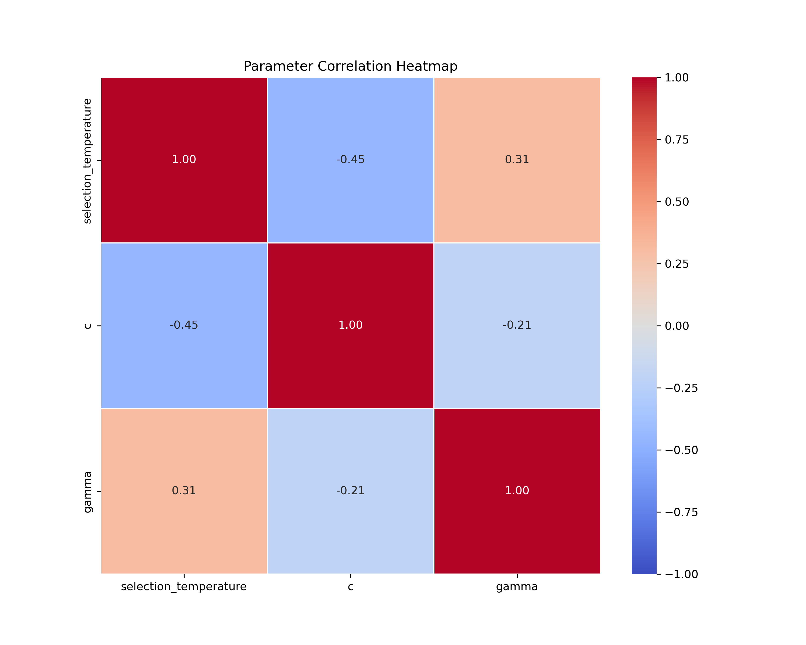

# Unconscious Modulation of Prediction Error Using Decoded Neurofeedback during Problem Solving with Sparse Rewards

This repository contains the source code for a 5-day decoded neurofeedback (DecNef) protocol targeting prediction error (PE) signals. 
I developed this framework to investigate whether PE can function as a pseudo-reward during problem-solving tasks under sparse rewards.

---

## 📊 Computational Modeling Results
The generative simulation utilizes an **Expected Value of Control (EVC)** framework to model how reinforced neural states influence decision speed and certainty. 
The agent successfully replicates the behavioral double dissociation observed in human participants.

| Solution Accuracy | Metacognitive Confidence | Reaction Time (Incorrect) |
| :---: | :---: | :---: |
|  |  |  |

> **Key Finding:** By artificially discounting the metabolic cost of doubt through a state shift ($\gamma$), the agent reproduces the impulsive reaction time reduction and confidence inflation found in the experimental group.

---

## 🔍 Parameter Identifiability
To ensure the scientific validity of the model, we performed a collinearity check on the fitted parameters. 
The low correlation between the metabolic cost ($c$) and the state shift ($\gamma$) confirms that these cognitive mechanisms are independently identifiable.

  

---

## 📂 Repository Structure
* **`src/real_time_pipeline/`**: The core DecNef engine for volume acquisition, preprocessing, and real-time decoding.
* **`src/analysis/modeling/`**: Computational simulation scripts, including the EVC metacontroller and hybrid agent logic.
* **`src/analysis/behavioral/`**: Statistical analysis and plotting scripts for human behavioral data.
* **`results/modeling_plots/`**: Generated PNG outputs from the simulation pipeline.

---

## 🛠️ Implementation Details
The metacontrol logic is implemented as a continuous evidence accumulation process:
$$evc\_signal = \beta_0 + \gamma - (c \times doubt)$$
Where $\beta_0$ represents baseline urgency, $\gamma$ is the neurofeedback-induced boost, and $c$ is the metabolic cost assigned to prediction errors.

---

## 📜 Citation & License
If you use this code or framework in your research, please cite:
> Kim, S., et al. (2026). Unconscious Modulation of Prediction Error Using Decoded Neurofeedback.

Licensed under the MIT License.