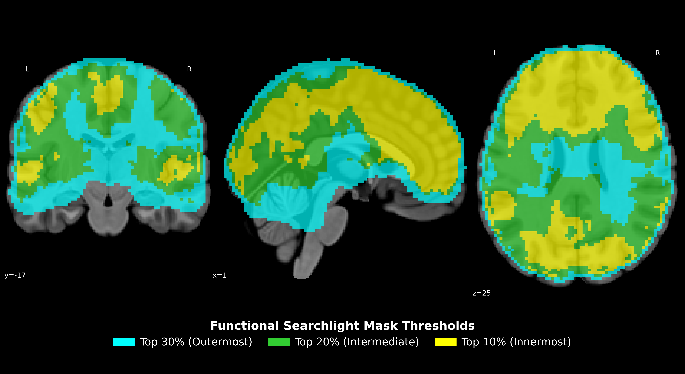
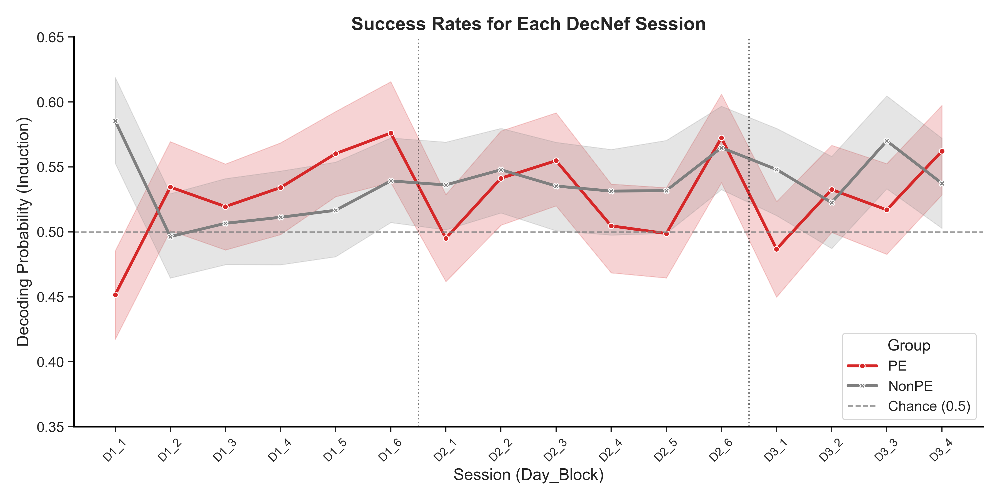

# Unconscious Modulation of Prediction Error Using Decoded Neurofeedback during Problem Solving with Sparse Rewards

This repository contains the source code for a 5-day decoded neurofeedback (DecNef) protocol targeting prediction error (PE) signals.
I developed this framework to investigate how internal computational signals function as teaching drives during abstract reasoning tasks under sparse rewards.

---

## 🔬 Neurofeedback Efficacy & Validation
Before evaluating behavioral outcomes, we verified the technical success of the DecNef intervention. 
These figures confirm that the real-time pipeline successfully engaged the targeted neural representations.

### 1. Functional Searchlight Targeting
We identified the most informative voxels for Prediction Error (PE) using a group-level searchlight analysis. 
The resulting nested masks provided the anatomical basis for real-time induction.

### 2. Real-Time Induction Trajectory
Throughout the 3-day training protocol, participants successfully re-created the target PE neural representations. 
The decoding probabilities remained consistently above the 50% chance level, confirming the efficacy of the closed-loop reinforcement.

---

## 📊 Model Validation
The project utilizes an **Expected Value of Control (EVC)** framework to simulate how reinforced neural states influence decision policies. 
The model evaluates the trade-off between the metabolic cost of deliberation and the expected payoff of continued search.

### 1. Solution Accuracy Baseline
The simulation agent is parameterized to match the baseline solution accuracy and learning trajectories of human participants.

### 2. Metacontrol Architecture
We model the decision process as a continuous evidence accumulation task. 
The simulation tests the hypothesis that a neural state shift ($\gamma$) modulates the sensitivity to computational friction during uncertainty.

---

## 🔍 Parameter Identifiability
To ensure the scientific validity of the model, we performed a collinearity check on the fitted parameters. 
The low correlation between the metabolic cost ($c$) and the state shift ($\gamma$) confirms that these cognitive mechanisms are independently identifiable within the optimization space.

  

---

## 📂 Repository Structure
* **`src/real_time_pipeline/`**: Core DecNef engine for volume acquisition, preprocessing, and real-time decoding.
* **`src/analysis/modeling/`**: Computational simulation scripts including EVC metacontroller and hybrid agent logic.
* **`src/analysis/behavioral/`**: Statistical analysis scripts for human behavioral data.
* **`results/`**: Figures and parameters generated by the modeling and imaging pipelines.

---

## 🛠️ Implementation Details
The metacontrol logic is implemented using a continuous EVC signal:
$$evc\_signal = \beta_0 + \gamma - (c \times doubt)$$
Where $\beta_0$ represents baseline urgency, $\gamma$ is the neurofeedback-induced state shift, and $c$ is the metabolic cost assigned to internal prediction errors.

---

## 📜 Citation & License
If you use this code or framework in your research, please cite:
> Kim, S., et al. (2026). Unconscious Modulation of Prediction Error Using Decoded Neurofeedback.

Licensed under the MIT License.